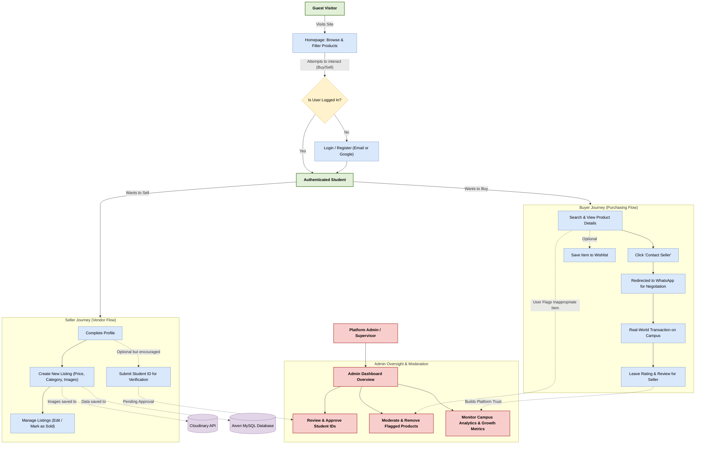
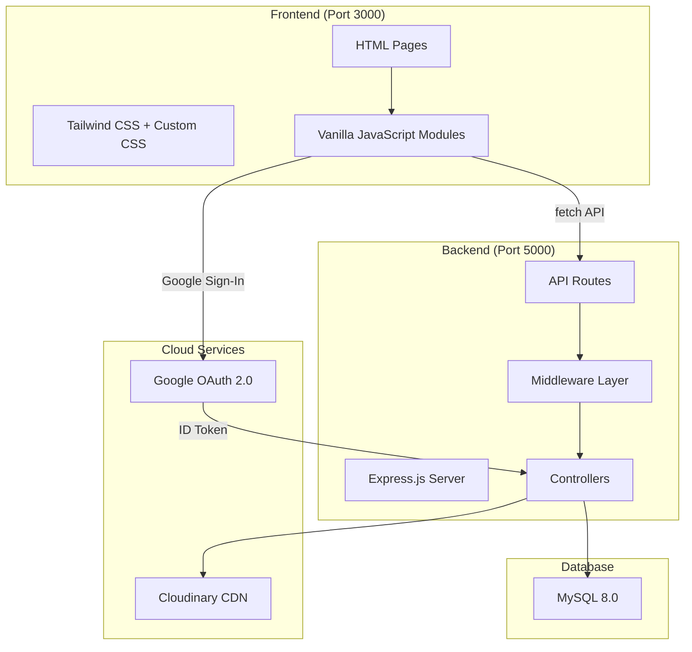
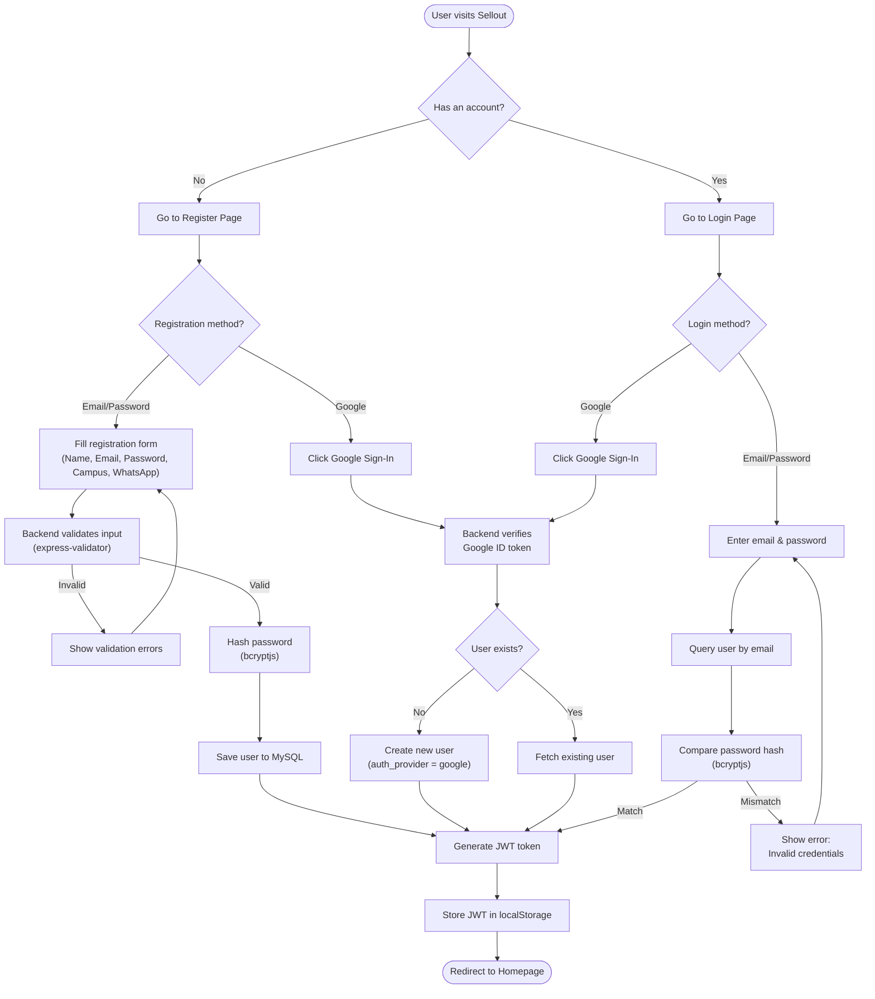
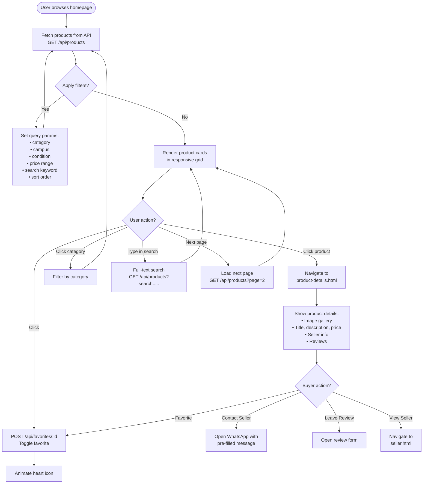
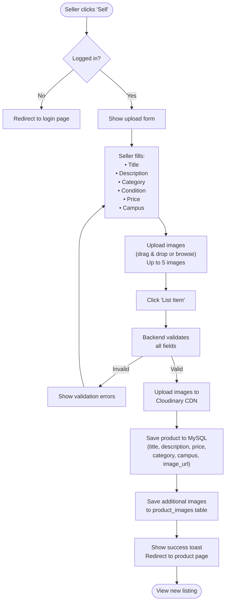
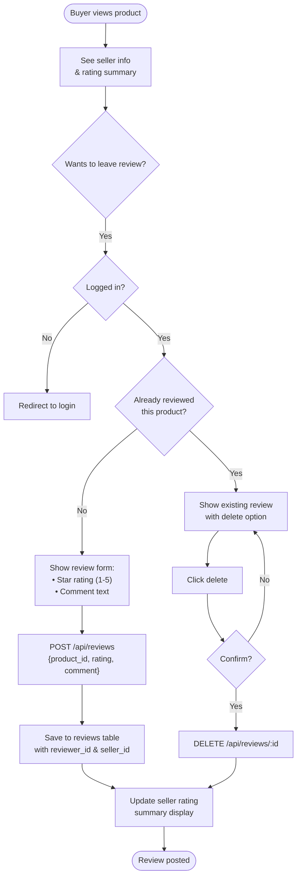
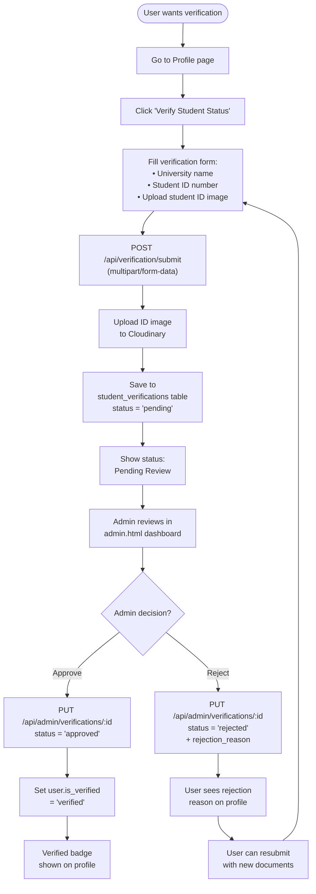
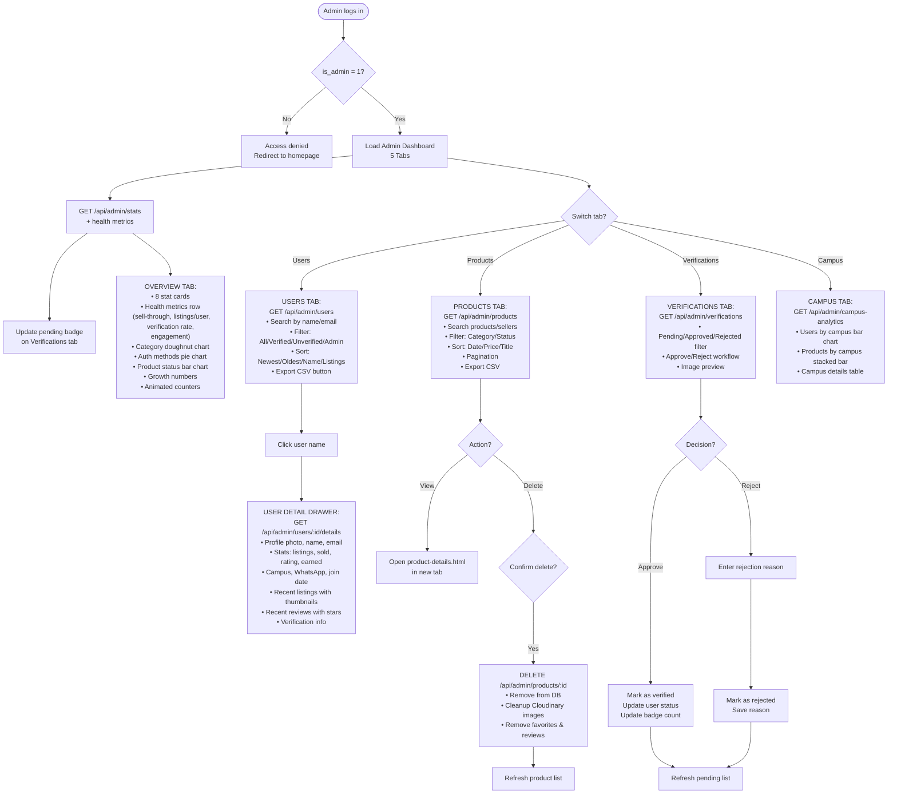
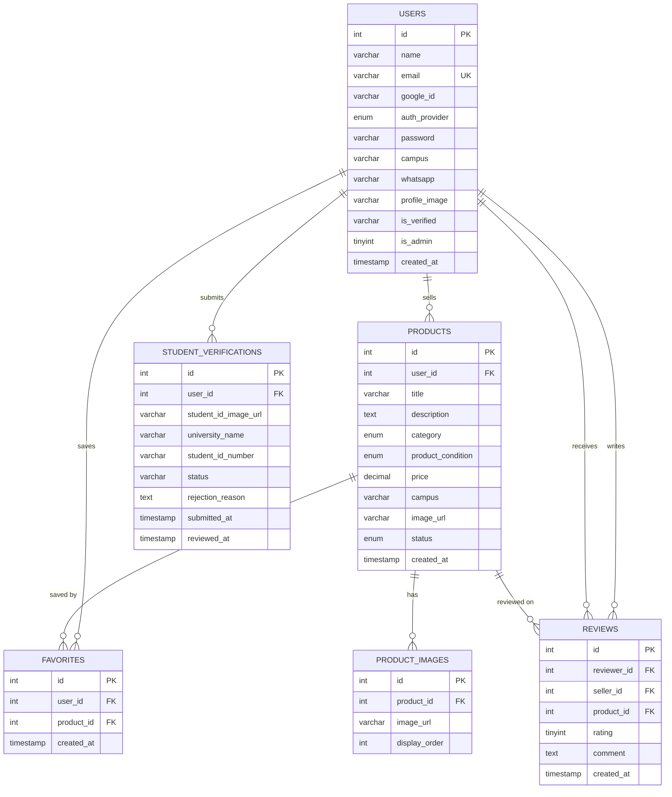

# Sellout — System Flowchart

## 1. High-Level Business Flow (For Investors & Supervisors)

This flowchart illustrates the core business logic and user journey of the Sellout platform, designed to give stakeholders a clear understanding of exactly how value is exchanged and how the platform is moderated.

### Key Takeaways for Investors & Supervisors:

1. **Frictionless Onboarding**: Guests can immediately begin browsing products, creating a "hook" before they are asked to create an account.
2. **Dual-Sided Marketplace**: Every authenticated student acts as both a potential buyer and a potential seller within their specific campus.
3. **Decentralized Transactions**: By pushing communication directly to WhatsApp, the platform avoids the heavy infrastructure costs of real-time chat while using a tool students already heavily rely on.
4. **Trust & Safety Mechanics**: A built-in 5-star rating system holds sellers accountable, and the Student ID Verification pipeline explicitly builds trust in the seller's legitimacy.
5. **Supervisor Control**: The integrated Admin panel provides full oversight over the health of the platform, the validity of its users, and the appropriateness of the marketplace listings.

---

## 2. Overall System Architecture

## 2. User Authentication Flow

## 3. Product Listing Flow

## 4. Product Upload Flow

## 5. Seller Review Flow

## 6. Student Verification Flow

## 7. Admin Dashboard Flow

## 8. Database Entity Relationship

