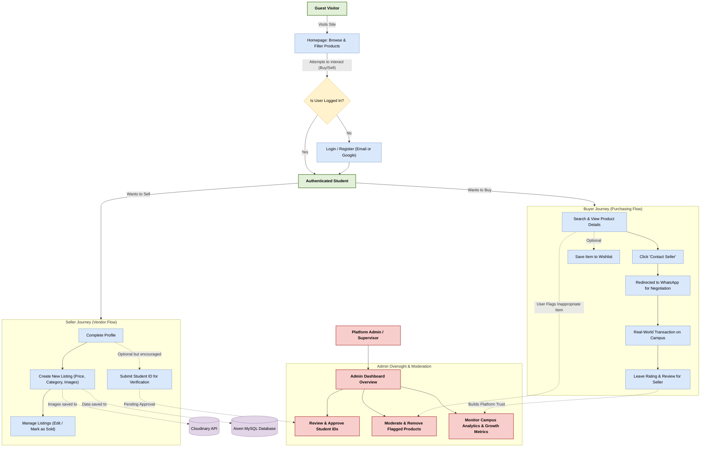

# Sellout Application Flow

This flowchart illustrates the high-level business logic and user journey of the Sellout platform. It is designed to give stakeholders, investors, and supervisors a clear understanding of how users interact with the marketplace and how the platform is moderated.

### Key Takeaways for Investors & Supervisors:

1. **Frictionless Onboarding**: Guests can immediately begin browsing products, creating a "hook" before they are asked to create an account. Google OAuth speeds up registration.
2. **Dual-Sided Marketplace**: Every authenticated student acts as both a potential buyer and a potential seller within their specific campus.
3. **Decentralized Transactions**: By pushing communication directly to WhatsApp, the platform avoids the heavy infrastructure costs of real-time chat while using a tool students already heavily rely on.
4. **Trust & Safety Mechanics**: 
   - A built-in 5-star rating system holds sellers accountable.
   - The Student ID Verification pipeline explicitly builds trust in the seller's legitimacy.
   - Community reporting features allow students to flag bad actors directly to the Admin Dashboard.
5. **Supervisor Control**: The integrated Admin panel provides full oversight over the health of the platform, the validity of its users, and the appropriateness of the marketplace listings.
